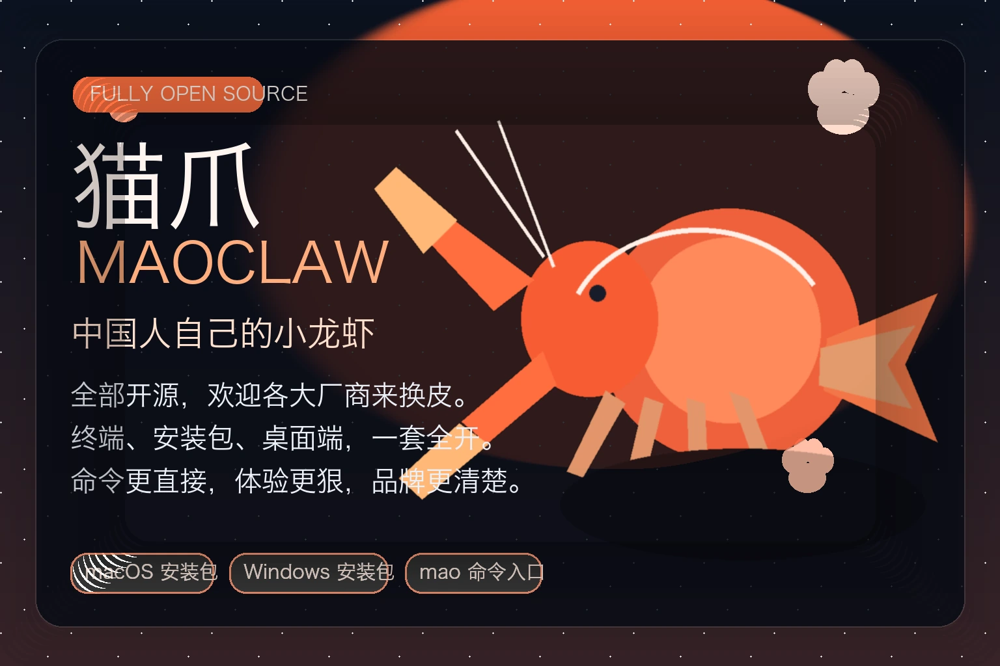

<p align="center">
  
</p>

<h1 align="center">maoclaw</h1>

<p align="center">
  <strong>maoclaw / 猫爪</strong><br/>
  Open-source agent runtime and customization platform for domain-specific AI systems
</p>

<p align="center">
  Community nickname in Chinese: <strong>机器猫</strong><br/>
  Built in Rust for teams that need serious orchestration, memory, tools, skills, and operator control
</p>

<p align="center">
  Official website: <a href="https://xinxiang.xin">xinxiang.xin</a><br/>
  GitHub: <a href="https://github.com/miounet11/maoclaw">miounet11/maoclaw</a>
</p>

<p align="center">
  <a href="docs/i18n/zh/README.md">中文</a> /
  <a href="docs/i18n/en/README.md">English</a> /
  <a href="docs/i18n/ja/README.md">日本語</a>
</p>

<p align="center">
  
  
  
  
  
</p>

```bash
curl -fsSL "https://raw.githubusercontent.com/miounet11/maoclaw/main/install.sh?$(date +%s)" | bash
```

## Overview

`maoclaw` is a fully open-source, local-first AI agent runtime built in Rust.
It is designed for teams that need a real foundation for agent products, agent orchestration, and domain-specific AI workers, not just a thin chat shell.

The project combines one runtime across CLI, RPC, SDK, and desktop surfaces while keeping the hard parts explicit:

- agent orchestration
- tool execution
- session lifecycle
- memory and knowledge loading
- skills and prompt resources
- provider routing
- security and operator governance

`maoclaw` is meant to be adapted, embedded, and extended for vertical workflows across industries.
That includes software engineering, research, operations, support, internal assistants, knowledge systems, and custom industry agents with their own tools, memory, policy, and delivery surface.

## Brand System

- Official global name: `maoclaw`
- Official Chinese name: `猫爪`
- Community nickname in Chinese: `机器猫`
- Compatibility command: `pi`
- Branded binary: `maoclaw`
- Public repository, website, install flow, and release identity: `maoclaw`

The nickname `机器猫` is community-facing and informal.
The official product and repository identity remains `maoclaw / 猫爪`.

## Why maoclaw

Many AI agent projects optimize for surface novelty first and runtime quality second.

`maoclaw` is built around a different priority order:

- one runtime shared across direct use and integration surfaces
- explicit operator control over provider, model, tools, permissions, sessions, and resources
- first-class extensibility through skills, prompts, themes, and extensions
- deployment-ready packaging instead of demo-only flows
- open-source repository discipline that looks and feels like a serious software platform

## What Makes It Different

### 1. One Runtime, Multiple Surfaces

The same Rust runtime powers:

- `pi` interactive CLI
- `maoclaw` branded CLI
- single-shot / print usage
- JSON output flows
- stdin/stdout RPC mode
- Rust SDK sessions
- desktop packaging

That keeps semantics aligned across local use, automation, embedding, and product shells.

### 2. Built For Open Customization

`maoclaw` is not intended to stay generic forever.
It is designed to be customized into domain-specific agent systems.

Use it to build:

- coding and engineering agents
- research and intelligence workflows
- operations and approval pipelines
- knowledge and memory-heavy internal assistants
- customer support or service agents
- industry-specific vertical agents with custom prompts, tools, skills, policies, and UI

### 3. Operator-Grade Control

`maoclaw` exposes the parts that many systems hide:

- provider and model selection
- thinking level and runtime behavior
- tool enablement and policy
- session persistence, compaction, and export
- skill, prompt, theme, and extension loading
- doctor checks, configuration inspection, and release diagnostics

### 4. Runtime Discipline In Rust

The runtime is intentionally engineered for serious long-lived usage:

- Rust 2024
- `#![forbid(unsafe_code)]`
- single-binary delivery
- LTO + stripped release builds
- jemalloc enabled by default on supported targets

That gives the project a credible base for speed, deployability, and operational simplicity.

## Open Source Posture

`maoclaw` is fully open source under MIT and is presented as a public project, not an internal code drop.

Repository surfaces that matter on first contact:

- [LICENSE](LICENSE) - MIT license
- [CONTRIBUTING.md](CONTRIBUTING.md) - contribution workflow and expectations
- [SECURITY.md](SECURITY.md) - security reporting policy
- [CHANGELOG.md](CHANGELOG.md) - formal release history
- [.github/CODE_OF_CONDUCT.md](.github/CODE_OF_CONDUCT.md) - public collaboration expectations
- [.github/ISSUE_TEMPLATE](.github/ISSUE_TEMPLATE) - structured intake for bugs and features
- [.github/workflows](.github/workflows) - visible CI, conformance, publish, and release automation

The target impression is simple:
this should read like a top-tier open-source software platform, with clear product identity, clear docs, clear release discipline, and clear extension/customization paths.

## What Ships Today

`maoclaw` already provides a coherent end-to-end runtime:

- interactive terminal mode
- print mode and JSON output mode
- stdin/stdout RPC mode for external clients
- Rust SDK entrypoints for embedding
- native desktop packaging on the same runtime
- persistent sessions with continue, resume, fork, compact, and export flows
- built-in tools: `read`, `write`, `edit`, `bash`, `grep`, `find`, `ls`
- resource loading for skills, prompt templates, themes, and extensions
- operator commands for package install/update/search/list, config inspection, doctor checks, and migration

Core launch support is centered on:

- Anthropic
- OpenAI
- Gemini / Google
- Azure OpenAI

Broader provider routing and onboarding coverage is documented in [docs/providers.md](docs/providers.md) and [docs/provider-config-examples.md](docs/provider-config-examples.md).

## Architecture

At a high level, the system looks like this:

```text
CLI / Desktop / SDK / RPC
          |
      Agent Loop
          |
Providers / Tools / Sessions / Resources / Extensions
          |
Persistence / Config / Auth / Policy / Packaging
```

Key repository surfaces:

- `src/main.rs` - CLI entrypoint
- `src/agent.rs` - core agent loop
- `src/providers/` - provider implementations
- `src/tools.rs` - built-in tools
- `src/session.rs` - session persistence
- `src/rpc.rs` - RPC mode
- `src/sdk.rs` - embedding surface
- `src/extensions.rs` and `src/extensions_js.rs` - extension host and runtime
- `src/interactive.rs` - terminal interaction layer

## Quick Start

Set one provider key:

```bash
export ANTHROPIC_API_KEY="your-key"
```

Start interactive mode:

```bash
pi
pi "Summarize this repository"
pi --continue
```

Run single-shot mode:

```bash
pi -p "Explain this error"
pi --mode json -p "Return a structured summary"
```

Inspect available providers and models:

```bash
pi --list-providers
pi --list-models
```

Run health checks:

```bash
pi doctor
pi config --show
```

### Desktop Setup For OpenAI-Compatible Routes

If you run your own gateway or buy capacity from a third-party OpenAI-compatible operator, the intended desktop path is:

1. Provider = `openai`
2. Model = the exact model id exposed by your operator
3. API URL = your gateway base URL, usually ending in `/v1`
4. API key = the operator key for that route
5. Save desktop defaults, then run `Test connection`

The desktop settings panel persists provider, model, API URL override, and API key through the same runtime configuration path used by the CLI and agent surfaces.

## Installation And Packaging

Install the latest public build:

```bash
curl -fsSL "https://raw.githubusercontent.com/miounet11/maoclaw/main/install.sh?$(date +%s)" | bash
```

Desktop release downloads are published on GitHub Releases and mirrored on `xinxiang.xin`:

- macOS Apple Silicon installer: `.pkg`
- macOS portable desktop archive: `.zip`
- Windows x86_64 portable desktop archive: `.zip`

Build from source:

```bash
cargo build --release

./target/release/pi --version
./target/release/maoclaw --version
```

Build the macOS desktop surface:

```bash
cargo build --release --bin pi_desktop --features desktop-iced
bash scripts/build_macos_app.sh --install
```

## Verification

Fast local verification:

```bash
./verify --profile smoke
./verify --profile smoke-extended
./verify --profile quick
./verify
./verify --recommend-profile
./verify --recommend-profile --json
```

Recommended use:

- `smoke` for the fastest curated regression pass
- `smoke-extended` for broader smoke coverage before `quick`
- `quick` for the normal development loop
- default `verify` for full checkpoint validation
- `recommend-profile` to choose the lightest sensible validation depth from current git changes
- `recommend-profile --json` for machine-readable workflow decisions

Decision guide:

- docs or wrapper-only change: use the narrowest meaningful check
- one Rust module, low-risk change: `./verify --profile smoke`
- multi-module non-E2E change: `./verify --profile quick`
- sessions, extensions, TUI, RPC, or startup wiring changes: `./verify`

The top-level `verify` entrypoint keeps the local workflow stable even as the underlying test orchestration evolves.

`smoke` auto-detects `rch` when available and falls back to local Cargo when it is not, so the fast path works on more developer machines by default.
It now defaults to a smaller `core` target set for lower green-path latency; use `./verify --profile smoke-extended` for broader smoke coverage.
It also defaults to a fast lint scope (`lib+bins` and `tests`); set `SMOKE_LINT_PROFILE=full` when you explicitly want `benches` and `examples` included in the smoke pass.
It now stops early on lint failure by default to avoid wasting compile/test time; set `SMOKE_CONTINUE_AFTER_LINT_FAIL=1` if you explicitly want both lint and test results in one smoke run.

For deployment details, use [docs/deployment-guide.md](docs/deployment-guide.md).

## Documentation

Start here:

- [STATUS.md](STATUS.md) - current public truth snapshot
- [docs/README.md](docs/README.md) - canonical documentation map
- [docs/open-source-overview.md](docs/open-source-overview.md) - project positioning and OSS posture
- [docs/deployment-guide.md](docs/deployment-guide.md) - installation and rollout

Usage and operator docs:

- [docs/settings.md](docs/settings.md)
- [docs/models.md](docs/models.md)
- [docs/session.md](docs/session.md)
- [docs/tree.md](docs/tree.md)
- [docs/rpc.md](docs/rpc.md)
- [docs/sdk.md](docs/sdk.md)
- [docs/providers.md](docs/providers.md)
- [docs/provider-auth-troubleshooting.md](docs/provider-auth-troubleshooting.md)
- [docs/troubleshooting.md](docs/troubleshooting.md)

Customization and extension docs:

- [docs/skills.md](docs/skills.md)
- [docs/prompt-templates.md](docs/prompt-templates.md)
- [docs/themes.md](docs/themes.md)
- [docs/extension-architecture.md](docs/extension-architecture.md)

Multilingual portals:

- [中文文档](docs/i18n/zh/README.md)
- [English documentation](docs/i18n/en/README.md)
- [日本語ドキュメント](docs/i18n/ja/README.md)

## Scope Discipline

`maoclaw` is ambitious, but the public story should stay precise.

Reasonable claims today:

- serious Rust AI agent runtime
- open-source platform for customizable agent systems
- terminal-first product with integration surfaces
- usable local development workflows today
- explicit operator control and documented boundaries

Claims to avoid until evidence catches up:

- universal drop-in replacement for every coding-agent stack
- certified compatibility across every integration surface
- stable third-party extension compatibility across the full ecosystem
- universal enterprise rollout guarantees

For the current boundary docs, see:

- [STATUS.md](STATUS.md)
- [docs/maozhua-v0.1-support-scope.md](docs/maozhua-v0.1-support-scope.md)
- [docs/maozhua-v0.1-known-limitations.md](docs/maozhua-v0.1-known-limitations.md)

## Project Direction

The strongest public story today is not imitation.
It is that `maoclaw` is becoming a serious open-source agent platform with:

- a Rust-native runtime core
- one runtime shared across direct use and integration surfaces
- explicit operator control
- durable customization surfaces
- a repo and documentation system that can credibly support international open-source adoption
